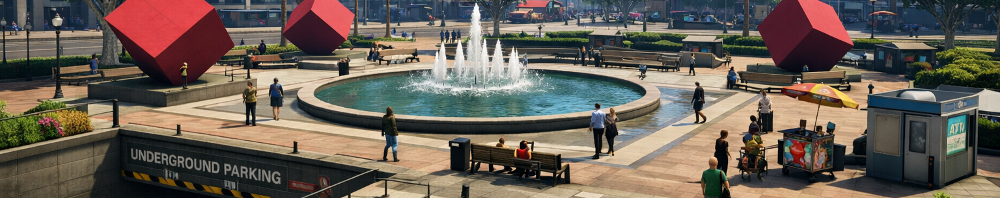

# Welcome to TG-11 Scripts Documentation

Our FiveM Store provides high-quality, optimized scripts and UI systems designed to enhance roleplay servers. We focus on modern, minimal, and performance-friendly solutions, including advanced menus, character systems, inventory integrations, and custom frameworks. Every product is built with clean code, easy configuration, and long-term server stability in mind, ensuring a smooth experience for both developers and players.

## Preview

## Store 
Tebex : https://tg11.tebex.io/
## Support
Discord: https://discord.gg/cm7W9JYyaV
